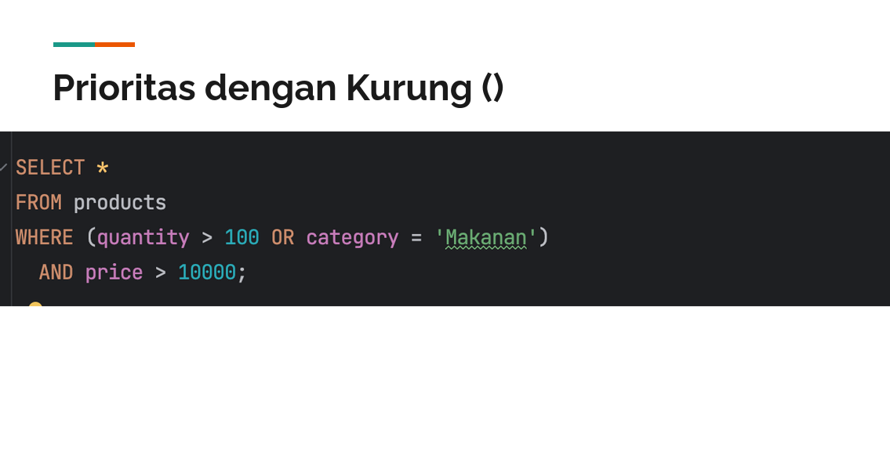

# Pengenalan Database Management System

- DBMS adalah aplikasi yang digunakan untuk me-manage data
- Tanpa menggunakan DBMS, untuk me-manage data, seperti data produk, data customer, data penjualan, kita harus simpan dalam bentuk file (misal seperti ketika menggunakan Excel)
- DBMS biasanya berjalan sebagai aplikasi server yang digunakan untuk me-manage data, kita hanya tinggal memberi perintah ke DBMS untuk melakukan proses manajemen datanya, seperti menambah, mengubah, menghapus atau mengambil data
- Contoh DBMS yang populer seperti MySQL, PostgreSQL, MongoDB, Oracle, dan lain-lain

# Pengenalan Relational Database

- Ada banyak sekali jenis-jenis DBMS, seperti Relational Database, Document Database, Key-Value Database, dan lain-lain
- Namun yang masih populer dan kebanyakan orang gunakan adalah relational database
- Relational database cukup mudah dimengerti dan dipelajari karena kita sudah terbiasa menyimpan data dalam bentuk tabular (tabel) seperti di Microsoft Excel atau di Google Doc Spreadsheet
- Selain itu relational database memiliki perintah standard menggunakan SQL, sehingga kita mudah ketika ingin berganti-ganti aplikasi database (seperti MySQL, Oracle, PostgreSQL dan lain-lain)

# Database Client

- Database client adalah aplikasi yang digunakan untuk berkomunikasi dengan DBMS
- Biasanya DBMS sudah menyediakan database client sederhana yang bisa kita gunakan untuk berkomunikasi dengan DBMS agar lebih mudah
- Atau kita bisa membuat aplikasi untuk berkomunikasi dengan DBMS, misal membuat aplikasi database client menggunakan Java, PHP atau bahasa pemrograman lainnya

# Database File

- Mayoritas DBMS menyimpan datanya di file, walaupun ada beberapa database yang hanya menyimpan datanya di memory (RAM)
- Namun jangan berpikir file database yang disimpan berupa file seperti Excel atau CSV (Comma Separated Value), tapi jauh lebih kompleks
- Database File akan di optimasi oleh DBMS agar mempermudah DBMS dalam manajemen datanya, seperti insert, update, delete dan select
- Tiap DBMS biasanya memiliki cara masing-masing mengelola Database File nya, dan kita tidak perlu harus tau, karena yang kita perlu tahu hanya cara berkomunikasi ke DBMS

# SQL

- Structured Query Language
- Merupakan bahasa yang digunakan untuk mengirim perintah ke DBMS
- SQL adalah bahasa yang mudah karena hanya berisi instruksi untuk menyimpan, mengubah, menghapus atau mengambil data melalui DBMS
- Secara garis besar, semua perintah SQL di Relational Database itu hampir sama, namun biasanya tiap DBMS ada improvement yang membedakan hal-hal kecil dalam perintah SQL, namun secara garis besar perintahnya tetap sama

# PostgreSQL

- PostgreSQL adalah DBMS Relational OpenSource yang sangat populer, terutama di perusahaan enterprise
- Tidak hanya OpenSource, PostgreSQL juga gratis untuk digunakan
- Proyek PostgreSQL dimulai sejak tahun 1986, dibawah arahan Professor Michael Stonebreaker di Universitas California, Berkeley
- PostgreSQL sangat populer sekali dikalangan perusahaan Enterprise
- <https://www.postgresql.org/>

<https://db-engines.com/en/ranking/relational+dbms>

# PostgreSQL vs MySQL

- MySQL sampai sekarang menjadi salah satu DBMS OpenSource yang paling populer di dunia
- Namun, banyak perusahaan besar yang menggunakan database PostgreSQL, hal ini dikarenakan PostgreSQL memiliki fitur yang lebih kaya dibandingkan MySQL
- MySQL fokus pada performa dan kecepatan, oleh karena itu fitur nya tidak sebanyak di PostgreSQL

# Menggunakan PostgreSQL Client

- PostgreSQL Client adalah aplikasi berbasis terminal yang disediakan oleh PostgreSQL untuk berkomunikasi dengan PostgreSQL Server
- Karena berbasis terminal, sehingga PostgreSQL Client sangat cocok untuk kita gunakan misal ketika di server production, dimana kita menginstall PostgreSQL di linux server yang berbasis terminal misal
- Kita tidak perlu menginstall PostgreSQL Client secara terpisah, karena sudah tersedia di dalam aplikasi PostgreSQL ketika kita menginstallnya
- PostgreSQL Client bisa diakses lewat terminal dengan nama program psql

# DBeaver

- DBeaver adalah aplikasi GUI Client berbasis Desktop yang free dan opensource yang bisa digunakan sebagai aplikasi database client
- Aplikasi DBeaver sangat mempermudah kita melakukan manajemen data di PostgreSQL karena berbasis Desktop
- <https://dbeaver.io/>

# PGAdmin

- PGAdmin adalah aplikasi berbasis web yang bisa digunakan untuk manajemen data di PostgreSQL
- Aplikasi PGAdmin dulunya berupa aplikasi desktop, namun diversi terbaru diubah menjadi aplikasi web
- <https://www.pgadmin.org/>

# JetBrains DataGrip

- DataGrip adalah aplikasi Database Client yang berbayar
- DataGrip mendukung banyak sekali DBMS sehingga kita cukup menggunakan DataGrip untuk manajemen semua database yang kita gunakan
- Selain mendukung Relational DBMS, DataGrip juga mendukung DBMS yang NoSQL seperti MongoDB, Cassandra, dan lain-lain
- <https://www.jetbrains.com/datagrip/>

# Run PostgreSQL with Docker Compose

- docker compose -p belajar-postgresql-dasar up
- docker exec -it <mycontainer postgresql> sh

# Database

- Database adalah tempat kita menyimpan table di PostgreSQL
- Jika kita misalkan table di PostgreSQL adalah sebuah file, maka database adalah folder nya, dimana kita bisa menyimpan banyak table di sebuah database
- Biasanya pembuatan kita akan membuat satu database untuk satu jenis aplikasi, walaupun satu aplikasi bisa menggunakan lebih dari satu database, namun lumrahnya, satu aplikasi akan menggunakan satu database

# Menggunakan PostgreSQL Client

- psql --host=localhost --port=5432 --dbname=postgres --username=khannedy --password

# Melihat Semua Database di PostgreSQL

- \\l
- select datname from pg_database;

# Membuat Database

- create database nama_database;

# Menghapus Database

- drop database nama_database;

# Menggunakan Database

- \\c namadatabase

# Tipe Data

- Saat kita membuat tabel di Excel, kita bisa menentukan tipe data apa yang kita masukkan ke tiap kolom di Excel
- Di PostgreSQL, kita juga bisa menentukan tipe data tiap kolom yang kita buat di sebuah tabel
- Ada banyak sekali tipe data yang tersedia di PostgreSQL, dari yang sederhana, sampai yang kompleks.
- Biasanya kita akan menggunakan tipe data sesuai dengan kebutuhan kolom yang perlu kita buat

# Tipe Data Number

- Secara garis besar, tipe data number di PostgreSQL ada dua jenis;
- Integer, atau tipe number bilangan bulat
- Floating Point, atau tipe data number pecahan

# DECIMAL / NUMERIC

- Selain Integer dan Floating Point, di PostgreSQL terdapat tipe data DECIMAL / NUMERIC
- Ini tipe data number khusus yang bisa ditentukan jumlah precision dan scale nya

# Tipe Data String

- Selain number, biasanya kita sering menyimpan data di dalam tabel dalam bentuk tulisan
- Tipe data ini namanya tipe data String atau Text
- Ada banyak tipe data String di PostgreSQL

# CHAR dan VARCHAR

- Pertama tipe data String di PostgreSQL adalah CHAR dan VARCHAR
- Kita bisa menentukan jumlah panjang maksimal karakter yang bisa ditampung oleh CHAR dan VARCHAR dengan menggunakan kurung buka lalu masukan jumlah maksimal karakter dan diakhiri kurung tutup
- Misal, CHAR(10) atau VARCHAR(10) artinya tipe data String dengan maksimal jumlah karakternya adalah 10 karakter
- Maksimum ukuran CHAR atau VARCHAR adalah 65535 karakter

# Perbedaan CHAR dan VARCHAR

# Text

- Selain CHAR dan VARCHAR, tipe data String yang lainnya adalah TEXT
- Berbeda dengan CHAR dan VARCHAR yang kita bisa tentukan panjang maksimum nya, TEXT tidak memiliki maksimum  panjang nya

# Tipe Data Date dan Time

- Selain tipe data Number dan String, biasanya kadang kita sering menyimpan data waktu atau tanggal
- Sebenarnya bisa kita gunakan String untuk menyimpan data waktu atau tanggal, namun itu tidak direkomendasikan, karena akan menyulitkan kita ketika nanti butuh melakukan manipulasi waktu atau tanggal di PostgreSQL

# Jenis-Jenis Tipe Data Date dan Time

# Format Tipe Data Date dan Time

- Format penulisan tipe data waktu, bisa menggunakan format
- Timestamp : YYYY-MM-dd HH:mm:ss
- Date : YYYY-MM-dd
- Time : HH:mm:ss

# Tipe Data Boolean

- BOOLEAN adalah tipe data kebenaran, yang artinya datanya hanya ada dua jenis, benar atau salah
- Benar direpresentasikan dengan data TRUE, sedangkan salah direpresentasikan dengan data FALSE

# Tipe Data Enum

- Saat membuat kolom, kadang ada jenis tipe data Text, namun isi datanya sudah fix, misal Jenis Kelamin, Kategori, dan sejenisnya
- Kasus seperti itu bisa menggunakan tipe data Enum
- Tipe data Enum harus dibuat terlebih dahulu, dan ditentukan Value yang diperbolehkan

# Membuat Tipe Data Enum

- Untuk membuat tipe data enum, kita bisa menggunakan perintah :
- CREATE TYPE NAMA_ENUM AS ENUM ('VALUE1, ‘VALUE2’, 'VALUE3');

# Dan Lain-Lain

- Sebenarnya masih banyak jenis tipe data yang lain yang didukung oleh PostgreSQL, namun itu bisa kita pelajari jika memang ada kebutuhan spesifik
- Seperti misal tipe data binary, json, xml dan lain-lain
- <https://www.postgresql.org/docs/current/datatype.html>

# Table

- Data biasanya disimpan di dalam tabel di PostgreSQL
- Tiap tabel biasanya menyimpan satu jenis data, misal ketika kita membuat aplikasi toko online, kita akan membuat tabel barang, tabel pelanggan, tabel penjual, dan lain-lain
- Sebelum kita bisa memasukkan data ke tabel, kita wajib terlebih dahulu membuat tabelnya terlebih dahulu
- Dan tiap tabel yang kita buat, wajib ditentukan kolom-kolom nya, dan tipe data tiap kolom nya
- Kita juga bisa mengubah tabel yang sudah terlanjur dibuat, seperti menambah kolom baru, mengubah kolom yang sudah ada, atau menghapus kolom

# Melihat Table

- \\dt
- select * from pg_tables where schemaname = ‘public’;

# Melihat Struktur Table

- \\d nama_tabel

# Null Value

- Null adalah nilai ketika kita tidak mengisi data ke dalam kolom
- Secara default, saat kita membuat kolom, kolom tersebut bisa bernilai NULL, jika kita tidak ingin menerima nilai NULL, kita bisa menambahkan NOT NULL ketika pembuatan kolom nya

# Default Value

- Saat kita menyimpan data ke dalam tabel, lalu kita hanya menyimpan beberapa kolom (tidak semuanya), kolom yang tidak kita beri nilai secara default nilainya adalah NULL
- Jika kita ingin mengubah default value nya, kita bisa menambahkan perintah DEFAULT NILAI ketika pembuatan kolom nya
- Khusus tipe data DATETIME atau TIMESTAMP, jika kita ingin menggunakan default value dengan nilai waktu saat ini, kita bisa gunakan kata kunci CURRENT_TIMESTAMP

# Membuat Ulang Table

- TRUNCATE nama_tabel;

# Menghapus Table

- DROP TABLE nama_tabel;

# Insert Data

- Sebelum kita meng memasukkan data kedalam tabel, tabel harus dibuat terlebih dahulu
- Kita bisa menyebutkan kolom mana yang ingin kita isi, jika kita tidak menyebutkan kolom nya, artinya kolom tersebut tidak akan kita isi, dan secara otomatis kolom yang tidak kita isi, nilainya akan NULL, kecuali memiliki DEFAULT VALUE
- Untuk memasukkan data kedalam tabel, kita bisa menggunakan perintah SQL yang bernama INSERT

# Select Data

- Untuk mengambil data di tabel, kita bisa menggunakan SQL dengan kata kunci SELECT
- SELECT bisa digunakan untuk mengambil semua kolom yang ada di tabel, atau sebagian kolom saja
- Jika kita ingin mengambil semua kolom, kita bisa gunakan karakter * (bintang)
- Jika kita hanya ingin mengambil beberapa kolom saja, kita bisa sebutkan nama-nama kolom yang ingin kita ambil datanya

# Primary Key

- Saat kita membuat tabel, idealnya tiap tabel memiliki Primary Key
- Primary key adalah sebuah kolom yang kita tunjuk sebagai id dari tabel tersebut
- Primary key adalah identitas untuk tiap baris data di dalam tabel
- Primary key harus unik, tidak boleh ada data dengan primary key yang sama
- Kita bisa menunjuk kolom yang akan kita jadikan primary key

# Primary Key di Multiple Column

- Kita bisa membuat primary key dengan kombinasi beberapa kolom
- Namun disarankan untuk tetap menggunakan satu kolom ketika membuat primary key
- Kecuali ada kasus khusus, seperti membuat tabel yang berelasi MANY TO MANY (yang nanti akan kita bahas)

# Where Clause

- Saat mengambil data menggunakan perintah SQL SELECT, kadang kita ingin melakukan pencarian data
- Misal, kita ingin mengambil data barang yang harganya 1jt, atau mengambil data barang yang quantity nya 0 (stok nya kosong)
- Hal ini bisa kita lakukan dengan WHERE clause setelah perintah SELECT

# Update Data

- Untuk mengubah data di tabel, kita bisa menggunakan perintah SQL UPDATE
- Saat menggunakan SQL UPDATE, kita harus memberi tahu data mana yang akan di update dengan WHERE clause
- Hati-hati ketika meng-update data di table, jika sampai WHERE clause nya salah, bisa-bisa kita malah meng-update seluruh data di tabel
- Untuk update, kita harus beritahu, kolom mana yang akan di update

# Delete Data

- Setelah kita tahu cara menambah, mengubah dan mengambil data di tabel, terakhir yang perlu kita ketahui adalah menghapus data di table
- Untuk menghapus data di table, kita bisa menggunakan perintah SQL DELETE
- Perintah SQL DELETE sama seperti UPDATE, kita perlu memberi tahu data mana yang akan di hapus dengan WHERE clause
- Dan hati-hati, jangan sampai salah menentukan WHERE clause, karena jika salah, bisa-bisa kita akan menghapus seluruh data di table

# Alias

- PostgreSQL memiliki fitur untuk melakukan alias untuk kolom dan tabel
- Alias berguna jika kita ingin mengubah nama kolom atau nama tabel ketika melakukan SELECT data
- Mungkin saat ini alias untuk tabel tidak terlalu terlihat gunanya, tapi nanti ketika kita telah mempelajari tentang JOIN, maka fitur alias untuk tabel sangat berguna sekali

# Where Operator

- Sebelumnya di materi where clause kita sudah menggunakan operator = (sama dengan)
- Sebenarnya sangat banyak sekali operator yang bisa kita gunakan ketika menggunakan where clause
- Sekarang kita akan bahas satu per satu

# Operator Perbandingan

# AND dan OR Operator
- Kadang kita ingin mencari data dengan beberapa gabungan kondisi, kita bisa menggunakan operator AND dan OR
- AND dan OR digunakan untuk menggabungkan beberapa dua operator

# Hasil Operator AND

# Hasil Operator OR

# Prioritas dengan Kurung ()

# LIKE Operator
- LIKE operator adalah operator yang bisa kita gunakan untuk mencari sebagian data dalam String
- Ini cocok sekali ketika kita hanya ingin mencari sebagian kata dalam String
- Namun perlu diingat, operasi LIKE itu sangat lambat, oleh karena itu, tidak disarankan jika datanya sudah terlalu besar di tabel
- Operasi LIKE case sensitive, jadi huruf besar dan kecil juga berpengaruh, jika kita ingin tidak case sensitive, bisa menggunakan ILIKE

# Hasil Operator LIKE

# NULL Operator
- Untuk mencari data yang berisi NULL, kita tidak bisa menggunakan operator perbandingan = NULL.
- Ada operator khusus untuk mencari data NULL, yaitu menggunakan NULL operator
- IS NULL, artinya mencari yang NULL
- IS NOT NULL, artinya mencari yang tidak NULL

# BETWEEN Operator
- Kadang kita ingin mencari data yang >= dan \<= secara sekaligus
- Misal kita ingin mencari products yang harganya antara 10000 sampai 20000
- Untuk melakukan ini, kita bisa menggunakan WHERE price >= 10000 AND price \<= 20000
- Namun ada operator BETWEEN yang bisa kita gunakan agar lebih sederhana
- Untuk kebalikannya, kita bisa gunakan NOT BETWEEN

# IN Operator
- Operator IN adalah operator untuk melakukan pencarian sebuah kolom dengan beberapa nilai.
- Misal kita ingin mencari products dengan category Makanan atau Minuman, maka kita bisa menggunakan operator IN
- Untuk kebalikannya, kita bisa menggunakan NOT IN

# Order By Clause
- Untuk mengurutkan data ketika kita menggunakan perintah SQL SELECT, kita bisa menambahkan ORDER BY clause
- ORDER BY clause digunakan untuk mengurutkan data berdasarkan kolom yang dipilih, dan jenis urutan (ASC atau DESC)
- Kita juga bisa mengurutkan tidak hanya terhadap satu kolom, tapi beberapa kolom

# Limit Clause
- Mengambil seluruh data di tabel bukanlah pilihan bijak, apalagi jika datanya sudah banyak sekali
- Kita bisa membatasi jumlah data yang diambil dalam SQL SELECT dengan LIMIT clause
- Selain membatasi jumlah data, kita juga bisa meng-skip sejumlah data yang tidak ingin kita lihat
- LIMIT biasanya digunakan saat melakukan paging di aplikasi kita, dengan kombinasi OFFSET

# Select Distinct Data
- Saat melakukan query dengan SELECT, kadang kita mendapatkan data yang duplikat
- Misal kita ingin melihat semua kategori di tabel products, maka otomatis hasil query SELECT akan duplikat, karena banyak sekali produk dengan kategori yang sama
- Jika kita ingin menghilangkan data-data duplikat tersebut , kita bisa menggunakan SELECT dengan tambahan DISTINCT sebelum nama kolom nya

# Numeric Function
- PostgreSQL memiliki banyak sekali fitur untuk manipulasi data angka
- Hal ini memudahkan kita untuk memanipulasi data angka
- Secara garis besar, fitur ini dibagi menjadi dua, Arithmetic Operator dan Mathematical Function

# Mathematical Function
- Selain arithmetic operator, ada juga mathematical function
- Ini adalah kumpulan function yang terdapat di PostgreSQL yang bisa kita gunakan sebagai fungsi-fungsi matematika
- Ada banyak sekali, dan tidak bisa kita bahas semua
- <https://www.postgresql.org/docs/15/functions-math.html>

# Auto Increment
- Kadang kita butuh angka yang berurut untuk membuat primary key, misal 1, 2, 3, dan seterusnya.
- Untuk melakukan hal ini secara manual bukanlah hal bijak, apalagi jika aplikasi yang kita buat diakses oleh banyak orang secara bersamaan
- PostgreSQL memiliki tipe data Number bernama SERIAL, fitur ini bisa kita gunakan untuk membuat function yang akan otomatis mengembalikan nilai yang selalu naik ketika dipanggil
- Dengan menggunakan SERIAL, kita tidak perlu lalu memasukkan data primary key secara manual, secara otomatis nilai primary key akan naik

# Sequence
- Saat kita menggunakan tipe data SERIAL, sebenarnya dibelakangnya, PostgreSQL menggunakan Sequence
- Sequence adalah fitur dimana kita bisa membuat function auto increment
- Saat menggunakan tipe data SERIAL pada Primary Key, secara otomatis PostgreSQL akan membuat Sequence, dan memanggil function sequence nya sebagai default value untuk Primary Key nya

# String Function
- Sama seperti number, di PostgreSQL juga banyak menyediakan function untuk tipe data String
- Ada banyak sekali function-function yang bisa kita gunakan
- <https://www.postgresql.org/docs/15/functions-string.html>

# Date dan Time Function
- PostgreSQL juga menyediakan banyak sekali function yang bisa kita gunakan untuk mengolah data tipe Date dan Time
- <https://www.postgresql.org/docs/15/functions-datetime.html>

# Flow Control Function
- PostgreSQL memiliki fitur flow control function
- Ini mirip IF ELSE di bahasa pemrograman
- Tapi ingat, fitur ini tidak se kompleks yang dimiliki bahasa pemrograman
- <https://www.postgresql.org/docs/current/functions-conditional.html>

# Aggregate Function
- PostgreSQL mendukung function-function untuk melakukan aggregate
- Misal, kita ingin melihat harga paling mahal di table product, atau harga termurah, atau rata-rata harga produk, atau total jumlah data di table, dan lain-lain
- <https://www.postgresql.org/docs/current/functions-aggregate.html>

# Group By
- Kadang saat melakukan aggregate, kita ingin datanya di grouping berdasarkan kriteria tertentu
- Misal kita ingin melihat rata-rata harga product, tapi ingin per category
- Atau kita ingin melihat total semua product, tapi per category
- Hal ini bisa dilakukan di PostgreSQL dengan menggunakan GROUP BY clause
- GROUP BY clause ini hanya bisa digunakan jika kita menggunakan aggregate function

# Having Clause
- Kadang kita ingin melakukan filter terhadap data yang sudah kita grouping
- Misal kita ingin menampilkan rata-rata harga per kategori, tapi yang harganya diatas 10.000 misalnya
- Jika menggunakan WHERE di SELECT, hal ini tidak bisa dilakukan
- Untuk memfilter hasil aggregate function, kita harus menggunakan HAVING clause

# Constraint
- Di PostgreSQL, kita bisa menambahkan constraint untuk menjaga data di tabel tetap baik
- Constraint sangat bagus ditambahkan untuk menjaga terjadi validasi yang salah di program kita, sehingga data yang masuk ke database tetap akan terjaga

# Unique Constraint
- Unique constraint adalah constraint yang memastikan bahwa data kita tetap unique
- Jika kita mencoba memasukkan data yang duplikat, maka PostgreSQL akan menolak data tersebut

# Check Constraint
- Check constraint adalah constraint yang bisa kita tambahkan kondisi pengecekannya
- Ini cocok untuk mengecek data sebelum dimasukkan ke dalam database
- Misal kita ingin memastikan bahwa harga harus diatas 1000 misal
- Maka kita bisa menggunakan check constraint

# Index
- Secara default, PostgreSQL akan menyimpan data di dalam disk seperti tabel biasanya
- Hal ini menyebabkan, ketika kita mencari data, maka PostgreSQL akan melakukan pencarian dari baris pertama sampai terakhir, yang artinya semakin banyak datanya, maka akan semakin lambat proses pencarian datanya
- Kita bisa ubah cara PostgreSQL menyimpan data pada kolom, agar mudah dicari, yaitu menggunakan Index
- Saat kita membuat index, PostgreSQL akan menyimpan data dalam struktur data B-Tree : <https://en.wikipedia.org/wiki/B-tree>
- Tidak hanya akan mempermudah kita saat melakukan pencarian, index juga akan mempermudah kita ketika melakukan pengurutan menggunakan ORDER BY

# Cara Kerja Index
- Kita bisa membuat lebih dari satu index di table, dan setiap kita membuat index, kita bisa membuat index untuk beberapa kolom sekaligus
- Misal kita membuat index
- (col1, col2, col3)
- Artinya kita punya kemampuan untuk mencari lebih menggunakan index untuk kombinasi query di (col1), (col1, col2) dan (col1, col2, col3)

# Efek Samping Membuat Index
- Index mungkin akan mempercepat untuk proses pencarian dan query data
- Namun, saat kita membuat index, artinya PostgreSQL akan melakukan proses update data di index tiap kali kita menambah, mengubah atau menghapus data di table
- Artinya Index membuat proses pencarian dan query lebih cepat, tapi memperlambat proses manipulasi data (insert, update dan delete)
- Oleh karena itu, kita harus bijak saat membuat index

# Tidak Perlu Index
- Saat kita membuat PRIMARY KEY dan UNIQUE constraint, kita tidak perlu menambahkan lagi index
- Hal ini dikarenakan PostgreSQL secara otomatis akan menambahkan index pada kolom PRIMARY KEY dan UNIQUE constraint

# Full-Text Search
# Masalah dengan LIKE operator
- Kadang kita ingin mencari sebuah kata dalam tabel, dan biasanya kita akan menggunakan LIKE operator
- Operasi yang dilakukan LIKE operator adalah dengan cara mencari seluruh data di tabel dari baris pertama sampai terakhir, hal ini membuat operasi LIKE sangat lambat
- Menambah index di tabel juga tidak akan membantu, karen LIKE operator tidak menggunakan index
- PostgreSQL menyediakan fitur Full Text Search jika ada kasus kita ingin melakukan hal ini

# Full-Text Search
- Full-Text Search memungkinkan kita bisa mencari sebagian kata di kolom dengan tipe data String
- Ini sangat cocok ketika pada kasus kita memang membutuhkan pencarian yang tidak hanya sekedar operasi = (equals, sama dengan)
- <https://www.postgresql.org/docs/current/textsearch-intro.html>
- Di PostgreSQL, Full-Text Search menggunakan function to_tsvector(text) dan to_tsquery(query)
- Bahkan kita bisa menggunakan function tersebut tanpa membuat index, namun performanya akan sama saja dengan LIKE, lambat karena harus di cek satu-satu
- Operator Full-Text Search menggunakan @@, bukan =

# Full-Text Seach Index
- Untuk membuat index Full-Text Search kita bisa menggunakan perintah yang sama dengan index biasa, tapi harus disebutkan detail dari jenis index Full-Text Search nya

# Query Operator
- to_tsquery() mendukung banyak operator
- & untuk AND
- | untuk OR
- ! untuk NOT
- “” untuk semua data

# Tipe Data TSVECTOR
- Kita juga bisa secara otomatis membuat kolom dengan tipe data TSVECTOR
- Secara otomatis kolom tersebut berisi text yang memiliki index Full-Text Search

# Table Relationship
- Dalam Relational DBMS, salah satu fitur andalan nya adalah table relationship. Yaitu relasi antar tabel
- Kita bisa melakukan relasi dari satu tabel ke tabel lain.
- Dalam kehidupan nyata pun pasti kita akan sering membuat relasi antar tabel
- Misal, saat kita membuat aplikasi penjualan, di laporan penjualan pasti ada data barang. Jika di tabel artinya tabel penjualan akan berelasi dengan tabel barang
- Misal dalam aplikasi kampus, tabel mahasiswa akan berelasi dengan tabel mata kuliah, dan tabel dosen
- Dan lain-lain

# Foreign Key
- Saat membuat relasi tabel, biasanya kita akan membuat sebuah kolom sebagai referensi ke tabel lainnya
- Misal saat kita membuat tabel penjualan, di dalam tabel penjualan, kita akan menambahkan kolom id_produk sebagai referensi ke tabel produk, yang berisi primary key di tabel produk
- Kolom referensi ini di PostgreSQL dinamakan Foreign Key
- Kita bisa menambah satu satu lebih foreign key ke dalam sebuah tabel
- Membuat foreign key sama seperti membuat kolom biasanya, hanya saja kita perlu memberi tahu PostgreSQL bahwa itu adalah foreign key ke tabel lain

# Keuntungan Menggunakan Foreign Key
- Foreign key memastikan bahwa data yang kita masukkan ke kolom tersebut harus tersedia di tabel reference nya
- Selain itu saat kita menghapus data di tabel reference, PostgreSQL akan mengecek apakah id nya digunakan di foreign key di tabel lain, jika digunakan, maka secara otomatis PostgreSQL akan menolak proses delete data di tabel reference tersebut

# Ketika Menghapus Data Berelasi
- Seperti yang sebelumnya dibahas, ketika kita menghapus data yang berelasi, maka secara otomatis PostgreSQL akan menolak operasi delete tersebut
- Kita bisa mengubah fitur ini jika kita mau, ada banyak hal yang bisa dilakukan ketika data berelasi dihapus, defaultnya memang akan ditolak (RESTRICT)

# Behavior Foreign Key

# Join
- PostgreSQL mendukung query SELECT langsung ke beberapa tabel secara sekaligus
- Namun untuk melakukan itu, kita perlu melakukan JOIN di SQL SELECT yang kita buat
- Untuk melakukan JOIN, kita perlu menentukan tabel mana yang merupakan referensi ke tabel lain
- Join cocok sekali dengan foreign key, walaupun di PostgreSQL tidak ada aturan kalau JOIN harus ada foreign key
- Join di PostgreSQL bisa dilakukan untuk lebih dari beberapa tabel
- Tapi ingat, semakin banyak JOIN, maka proses query akan semakin berat dan lambat, jadi harap bijak ketika melakukan JOIN
- Idealnya kita melakukan JOIN jangan lebih dari 5 tabel, karena itu bisa berdampak ke performa query yang lambat

# One to One Relationship
# Jenis-Jenis Relasi Tabel
- Sekarang kita sudah tau untuk melakukan relasi antar tabel, kita bisa menggunakan FOREIGN KEY
- Dan untuk melakukan SELECT beberapa tabel, kita bisa menggunakan JOIN
- Dalam konsep relasi, ada banyak jenis-jenis relasi antar tabel
- Sekarang kita akan bahas dari yang pertama yaitu One to One relationship

# One to One Relationship
- One to One relationship adalah relasi antar tabel yang paling sederhana
- Artinya tiap data di sebuah tabel hanya boleh berelasi ke maksimal 1 data di tabel lainnya
- Tidak boleh ada relasi lebih dari 1 data
- Contoh misal, kita membuat aplikasi toko online yang terdapat fitur wallet, dan 1 customer, cuma boleh punya 1 wallet

# Membuat One to One Relationship
- Cara membuat One to One relationship cukup mudah
- Kita bisa membuat kolom foreign key, lalu set kolom tersebut menggunakan UNIQUE KEY, hal ini dapat mencegah terjadi data di kolom tersebut agar tidak duplikat
- Atau cara lainnya, kita bisa membuat tabel dengan primary key yang sama, sehingga tidak butuh lagi kolom untuk FOREIGN KEY

# One to Many Relationship
- One to many relationship adalah relasi antar tabel dimana satu data bisa digunakan lebih dari satu kali di tabel relasinya
- Berbeda dengan one to one yang cuma bisa digunakan maksimal 1 kali di tabel relasinya, one to many tidak ada batasan berapa banyak data digunakan
- Contoh relasi antar tabel categories dan products, dimana satu category bisa digunakan oleh lebih dari satu product, yang artinya relasinya nya one category to many products
- Pembuatan relasi one to many sebenarnya sama dengan one to one, yang membedakan adalah, kita tidak perlu menggunakan UNIQUE KEY, karena datanya memang bisa berkali-kali ditambahkan di tabel relasi nya

# Many to Many Relationship
- Many to Many adalah table relationship yang paling kompleks, dan kadang membingungkan untuk pemula
- Many to Many adalah relasi dimana ada relasi antara 2 tabel dimana table pertama bisa punya banyak relasi di table kedua, dan table kedua pun punya banyak relasi di table pertama
- Ini memang sedikit membingungkan, bagaimana caranya bisa relasi kebanyakan secara bolak balik, sedangkan di table kita cuma punya 1 kolom?
- Contoh relasi many to many adalah relasi antara produk dan penjualan, dimana setiap produk bisa dijual berkali kali, dan setiap penjualan bisa untuk lebih dari satu produk

# Bagaimana Implementasi Many to Many?
- Sekarang pertanyaannya, bagaimana implementasi many to many?
- Apakah kita harus menambahkan id_order di table products? atau id_product di table orders?

# Id Product di Table Order
- Jika kita menambahkan id_product di table orders, artinya sekarang sudah benar, bahwa 1 product bisa dijual berkali-kali
- Namun masalahnya adalah, berarti 1 order hanya bisa membeli 1 product, karena cuma ada 1 kolom untuk id_product
- Oke kalo gitu kita tambahkan id_product1, id_product2, dan seterusnya. Solusi ini bisa dilakukan, tapi tidak baik, artinya akan selalu ada maksimal barang yang bisa kita beli dalam satu order

# Id Order di Table Product
- Jika kita tambahkan id_order di table products, artinya sekarang 1 order bisa membeli lebih dari 1 product, oke sudah benar
- Tapi sayangnya masalahnya terbalik sekarang, 1 product cuma bisa dijual satu kali, tidak bisa dijual berkali-kali, karena kolom id_order nya cuma 1
- Kalupun kita tambah id_order1, id_order2 dan seterusnya di table product, tetap ada batasan maksimal nya
- Lantai bagaimana solusinya untuk relasi many to many?

# Membuat Table Relasi
- Solusi yang biasa dilakukan jika terjadi relasi many to many adalah, biasanya kita akan menambah 1 tabel ditengahnya
- Tabel ini bertugas sebagai jembatan untuk menggabungkan relasi many to many
- Isi table ini akan ada id dari table pertama dan table kedua, dalam kasus ini adalah id_product dan id_order
- Dengan demikian, kita bisa menambahkan beberapa data ke dalam tabel relasi ini, sehingga berarti satu product bisa dijual beberapa kali di dalam table order, dan satu order bisa membeli lebih dari satu product

# Jenis-Jenis Join
- Sebelumnya kita sudah bahas tentang JOIN table, tapi sebenarnya ada banyak sekali jenis-jenis JOIN table di PostgreSQL, diantaranya :
- INNER JOIN
- LEFT JOIN
- RIGHT JOIN
- FULL JOIN

# Inner Join
- INNER JOIN adalah mekanisme JOIN, dimana terdapat relasi antara tabel pertama dan tabel kedua
- Jika ada data di tabel pertama yang tidak memiliki relasi di table kedua ataupun sebaliknya, maka hasil INNER JOIN tidak akan ditampilkan
- Ini adalah default JOIN di PostgreSQL
- Jika kita menggunakan JOIN seperti yang sudah kita praktekan sebelumnya, sebenarnya itu akan melakukan INNER JOIN

# Left Join
- LEFT JOIN adalah mekanisme JOIN seperti INNER JOIN, namun semua data di table pertama akan diambil juga
- Jika ada yang tidak memiliki relasi di table kedua, maka hasilnya akan NULL

# Right Join
- RIGHT JOIN adalah mekanisme JOIN seperti INNER JOIN, namun semua data di table kedua akan diambil juga
- Jika ada yang tidak memiliki relasi di table pertama, maka hasilnya akan NULL

# Full Join
- Full Join adalah join dimana semua data di tabel pertama dan kedua akan ditampilkan
- Jika tidak ada data join, maka hasilnya akan berisi data Null

# Subquery di WHERE
- PostgreSQL mendukung pencarian data menggunakan WHERE dari hasil SELECT query
- Fitur ini dinamakan Subquery
- Contoh, kita ingin mencari products yang harganya diatas harga rata-rata, artinya kita akan melakukan SELECT dengan WHERE price > harga rata, dimana harga rata-rata perlu kita hitung menggunakan query SELECT lainnya menggunakan aggregate function AVG

# Subquery di FROM
- Selain di WHERE clause, Subquery juga bisa dilakukan di FROM clause
- Misal kita ingin mencari data dari hasil query SELECT, itu bisa kita lakukan di PostgreSQL

# Set Operetor
PostgreSQL mendukung operator Set, dimana ini adalah operasi antara hasil dari dua SELECT query. Ada banyak jenis operator Set, yaitu :

- UNION
- UNION ALL
- INTERSECT, dan
- EXCEPT

# UNION
- UNION adalah operasi menggabungkan dua buah SELECT query, dimana jika terdapat data yang duplikat, data duplikatnya akan dihapus dari hasil Query

# UNION ALL
- UNION ALL adalah operasi yang sama dengan UNION, namun data duplikat tetap akan ditampilkan di hasil query nya

# INTERSECT
- INTERSECT adalah operasi menggabungkan dua query, namun yang diambil hanya data yang terdapat pada hasil query pertama dan query kedua 
- Data yang tidak hanya ada di salah satu query, kan dihapus di hasil operasi INTERSECT 
- Data nya muncul tidak dalam keadaan duplikat

# EXCEPT
- EXCEPT adalah operasi dimana query pertama akan dihilangkan oleh query kedua 
- Artinya jika ada data di query pertama yang sama dengan data yang ada di query kedua, maka data tersebut akan dihapus dari hasil query EXCEPT

# Transaction
# Kenapa Butuh Transaction 
- Saat membuat aplikasi berbasis database, jarang sekali kita akan melakukan satu jenis perintah SQL per aksi yang dibuat aplikasi 
- Contoh, ketika membuat toko online, ketika customer menekan tombol Pesan, banyak yang harus kita lakukan, misal 
  - Membuat data pesanan di tabel order 
  - Membuat data detail pesanan di tabel order detail 
  - Menurunkan quantity di tabel produk 
  - Dan yang lainnya
- Artinya, bisa saja dalam satu aksi, kita akan melakukan beberapa perintah sekaligus 
- Jika terjadi kesalahan di salah satu perintah, harapannya adalah perintah-perintah sebelumnya dibatalkan, agar data tetap konsisten

# Database Transaction
- Database transaction adalah fitur di DBMS dimana kita bisa memungkinan beberapa perintah dianggap menjadi sebuah kesatuan perintah yang kita sebut transaction 
- Jika terdapat satu saja proses gagal di transaction, maka secara otomatis perintah-perintah sebelumnya akan dibatalkan 
- Jika sebuah transaction sukses, maka semua perintah akan dipastikan sukses

# Membuat Transaction

# Membatalkan Transaction

# Transaction di PostgreSQL

# Yang Tidak Bisa Menggunakan Transaction
- Perintah DDL (Data Definition Language) tidak bisa menggunakan fitur transaction 
- DDL adalah perintah-perintah yang digunakan untuk merubah struktur, seperti membuat tabel, menambah kolom, menghapus tabel, menghapus database, dan sejenisnya 
- Transaction hanya bisa dilakukan pada perintah DML (Data Manipulation Language), seperti operasi INSERT, UPDATE dan DELETE

# Locking
- Locking adalah proses mengunci data di DBMS 
- Proses mengunci data sangat penting dilakukan, salah satunya agar data benar-benar terjamin konsistensinya 
- Karena pada kenyataannya, aplikasi yang akan kita buat pasti digunakan oleh banyak pengguna, dan banyak pengguna tersebut bisa saja akan mengakses data yang sama, jika tidak ada proses locking, bisa dipastikan akan terjadi RACE CONDITION, yaitu proses balapan ketika mengubah data yang sama 
- Contoh saja, ketika kita belanja di toko online, kita akan balapan membeli barang yang sama, jika data tidak terjaga, bisa jadi kita salah mengupdate stock karena pada saat yang bersamaan banyak yang melakukan perubahan stock barang

# Locking Record
- Saat kita melakukan proses TRANSACTION, lalu kita melakukan prose perubahan data, data yang kita ubah tersebut akan secara otomatis di LOCK 
- Hal ini membuat proses TRANSACTION sangat aman 
- Oleh karena itu, sangat disarankan untuk selalu menggunakan fitur TRANSACTION ketika memanipulasi data di database, terutama ketika perintah manipulasinya lebih dari satu kali 
- Locking ini akan membuat sebuah proses perubahan yang dilakukan oleh pihak lain akan diminta untuk menunggu 
- Data akan di lock sampai kita melakukan COMMIT atau ROLLBACK transaksi tersebut

# Locking Record Manual
- Selain secara otomatis, kadang saat kita membuat aplikasi, kita juga sering melakukan SELECT query terlebih dahulu sebelum melakukan proses UPDATE misalnya. 
- Jika kita ingin melakukan locking sebuah data secara manual, kita bisa tambahkan perintah FOR UPDATE di belakang query SELECT 
- Saat kita lock record yang kita select, maka jika ada proses lain akan melakukan UPDATE, DELETE atau SELECT FOR UPDATE lagi, maka proses lain diminta menunggu sampai kita selesai melakukan COMMIT atau ROLLBACK transaction

# Deadlock
- Saat kita terlalu banyak melakukan proses Locking, hati-hati akan masalah yang bisa terjadi, yaitu DEADLOCK 
- Deadlock adalah situasi ada 2 proses yang saling menunggu satu sama lain, namun data yang ditunggu dua-duanya di lock oleh proses lainnya, sehingga proses menunggunya ini tidak akan pernah selesai.

# Contoh Deadlock
- Proses 1 melakukan SELECT FOR UPDATE untuk data 001 
- Proses 2 melakukan SELECT FOR UPDATE untuk data 002 
- Proses 1 melakukan SELECT FOR UPDATE untuk data 002, diminta menunggu karena di lock oleh Proses 2 
- Proses 2 melakukan SELECT FOR UPDATE untuk data 001, diminta menunggu karena di lock oleh Proses 1 
- Akhirnya Proses 1 dan Proses 2 saling menunggu 
- Deadlock terjadi
